# 语音模块工作流

## 完整流程图

```mermaid
sequenceDiagram
    participant U as 用户
    participant Mic as 麦克风(VAD)
    participant FE as 前端(Vue)
    participant BE as 后端(Django)
    participant LLM as LLM(DeepSeek)
    participant ASR as 阿里云 ASR
    participant TTS as 阿里云 TTS

    %% ========== ASR 阶段 ==========
    rect rgb(40, 60, 100)
        Note over U,TTS: 语音输入 (ASR)
        U->>Mic: 开始说话
        Mic->>Mic: Silero VAD 检测语音起止
        Mic->>Mic: Float32 → PCM 16bit 转换
        Mic->>FE: onSpeechEnd(audio)
        FE->>BE: POST /api/friend/message/asr/asr/<br/>FormData(audio.pcm)
        BE->>ASR: WebSocket connect<br/>run-task (gummy-realtime-v1)
        ASR-->>BE: task-started

        par 发送音频
            BE->>ASR: continue-task × N<br/>(3200字节/片 = 100ms PCM)
        and 接收识别
            ASR-->>BE: result-generated<br/>(sentence_end=true 时拼接)
        end

        BE->>ASR: finish-task
        ASR-->>BE: task-finished
        BE-->>FE: {"text": "识别结果"}
    end

    %% ========== 聊天 + TTS 阶段 ==========
    rect rgb(60, 40, 80)
        Note over U,TTS: 语音回复 (LLM + TTS 并行)
        FE->>BE: POST /api/friend/message/chat/<br/>(SSE: text/event-stream)
        BE->>BE: ContextBuilder 构建上下文<br/>(系统提示+语义记忆+摘要+近期消息)
        BE->>LLM: astream(inputs)<br/>(streaming=True)

        BE->>TTS: WebSocket connect<br/>run-task (cosyvoice-v3-flash)
        TTS-->>BE: task-started

        par tts_sender (发文本给LLM+TTS)
            loop LLM 流式输出
                LLM-->>BE: BaseMessageChunk
                BE->>TTS: continue-task (文本片段)
                BE->>BE: mq.put({content: text})
            end
            BE->>TTS: finish-task
        and tts_receiver (收TTS音频)
            loop TTS 流式返回
                TTS-->>BE: Binary MP3 帧
                BE->>BE: mq.put({audio: base64})
            end
        and 主线程 (SSE下发)
            loop mq.get() 轮询
                BE-->>FE: data: {"content":"..."}<br/>或 data: {"audio":"base64..."}
            end
        end

        BE-->>FE: data: [DONE]
    end

    %% ========== 前端渲染 ==========
    rect rgb(30, 70, 50)
        Note over U,FE: 前端渲染与播放
        FE->>FE: content → addToLastMessage<br/>(文字实时追加到气泡)
        FE->>FE: audio → base64解码 → Uint8Array<br/>→ audioQueue → SourceBuffer<br/>→ MediaSource 流式播放
        FE->>U: 文字逐字显示 + 音频流式播放
    end
```



## 数据流总览

```
┌─────────────────────────────────────────────────────────────────────────┐
│                           语音输入方向 (ASR)                             │
│                                                                         │
│  🎤 麦克风                                                               │
│    │                                                                     │
│    ▼                                                                     │
│  MicVAD (Silero VAD)                                                    │
│    │  检测语音起止, 输出完整语音段 Float32Array                           │
│    ▼                                                                     │
│  float32ToInt16() → PCM 16bit 16kHz mono                                │
│    │                                                                     │
│    ▼                                                                     │
│  POST /api/friend/message/asr/asr/  (HTTP, FormData)                    │
│    │                                                                     │
│    ▼                                                                     │
│  后端 ASRView                                                            │
│    │                                                                     │
│    ├─→ WebSocket 连接阿里云 ASR (gummy-realtime-v1)                      │
│    │     │                                                               │
│    │     ├─ asr_sender: 3200字节/片 (100ms) + 10ms节流                   │
│    │     └─ asr_receiver: 边发边收, sentence_end 时拼接                   │
│    │                                                                     │
│    ▼                                                                     │
│  返回识别文本 → 填入输入框 → 触发聊天请求                                  │
└─────────────────────────────────────────────────────────────────────────┘

┌─────────────────────────────────────────────────────────────────────────┐
│                         语音回复方向 (LLM + TTS)                         │
│                                                                         │
│  前端发起 SSE 请求                                                       │
│  POST /api/friend/message/chat/                                         │
│    │                                                                     │
│    ▼                                                                     │
│  后端 MessageChatView                                                    │
│    │                                                                     │
│    ├─ ContextBuilder 构建四层上下文                                       │
│    │    ├─ 系统提示 + 语义记忆 (800 token)                                │
│    │    ├─ 对话摘要 (500 token)                                           │
│    │    ├─ 近期消息滑窗 (6192 token)                                      │
│    │    └─ 当前用户消息                                                    │
│    │                                                                     │
│    ▼                                                                     │
│  ┌─────────────── 共享 Queue (mq) ───────────────┐                      │
│  │  text chunk ─┐                                 │                      │
│  │  audio chunk ┤ → 主线程 mq.get() → SSE yield  │                      │
│  │  None        ┘                                 │                      │
│  └────────────────────────────────────────────────┘                      │
│       ▲           ▲                                                      │
│       │           │                                                      │
│  ┌────┴────┐ ┌────┴─────┐                                                │
│  │tts_sender│ │tts_receiver│  ← asyncio.gather 并行                      │
│  └────┬────┘ └────┬─────┘                                                │
│       │           │                                                      │
│       ▼           ▲                                                      │
│  LLM astream    TTS WebSocket                                            │
│  (DeepSeek)     (CosyVoice)                                              │
│       │           │                                                      │
│       └───┬───────┘                                                      │
│           │  LLM chunk 同时发给 TTS 做 input                              │
│           │  TTS 返回 MP3 二进制帧做 output                                │
│                                                                         │
│  SSE 流输出:                                                             │
│    data: {"content":"你"}                                                │
│    data: {"content":"好"}                                                │
│    data: {"audio":"//MQxA..."}     ← 文字和音频交错                      │
│    data: {"content":"呀"}                                                │
│    data: {"audio":"//MQxB..."}                                           │
│    data: [DONE]                                                          │
│    ▼                                                                     │
│  前端 InputField.vue                                                     │
│    ├─ content → addToLastMessage → 文字气泡逐字显示                       │
│    └─ audio  → base64解码 → audioQueue → SourceBuffer → 流式播放         │
└─────────────────────────────────────────────────────────────────────────┘
```

## 关键参数

| 环节 | 参数 | 值 |
|------|------|----|
| ASR 音频格式 | 采样率 / 位深 / 声道 | 16kHz / 16bit / mono |
| ASR 分片大小 | 3200 字节 | = 100ms 音频 |
| ASR 分片节流 | asyncio.sleep | 10ms |
| ASR 模型 | 阿里云 DashScope | gummy-realtime-v1 |
| VAD 语音阈值 | positiveSpeechThreshold | 0.8 |
| VAD 静音阈值 | negativeSpeechThreshold | 0.65 |
| TTS 模型 | 阿里云 DashScope | cosyvoice-v3-flash |
| TTS 音频格式 | MP3 22050Hz | rate=1.25, pitch=1 |
| TTS 协议 | WebSocket duplex | 边收文本边出音频 |
| LLM 流式 | stream_mode | messages |
| SSE 音频编码 | base64 | 前端解码为 Uint8Array |
| 前端音频播放 | MediaSource + SourceBuffer | 流式追加, 无需等完整文件 |
